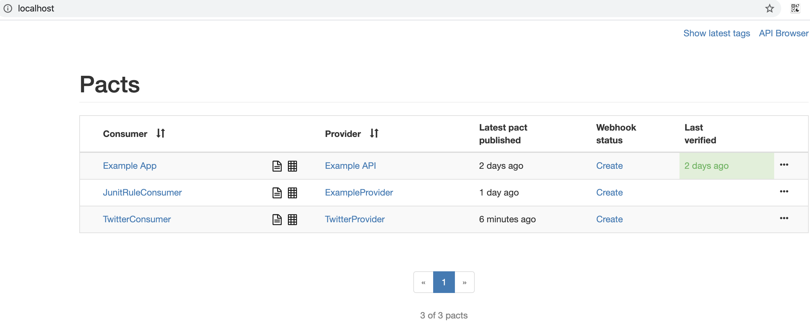

# PACT JVM Example for sample twitter APIs

## Step 1: Write a consumer test with JUnitRule 

* Write a consumer test against a mock with expectations of how the provider should behave. 

Example test: `java/twitter/LoginConsumerPactTest.java`

Use below command to run the consumer test

```zsh
./gradlew :example-consumer:clean test
```

* Step 1 would generate a .json file with the expectation of how the provider behavior should be in 
`grasp-contract-testing/pacts` folder with the name of the consumer and provider, in this case as `TwitterConsumer-TwitterProvider.json`

## Step 2: Define the provider API

`example-provider` project creates a simple representation of set of login APIs for a twitter like system 
Refer to this guide to understand more about SpringBoot and how to create some simple APIs [spring.io](https://spring.io/guides/gs/rest-service/)

### How to run

```bash
# Run the app using below
./gradlew :example-provider:bootRun

# Alternatively, build using below
./gradlew :example-provider:build

# and run using below:
java -jar target/example-provider-1.0.0.jar
```

You can kill the server using Ctrl + C (Mac) however this will not kill the tomcat server.

To manually kill any process listening on port 8082 use below:

```bash
kill `lsof -i -n -P | grep TCP | grep 8082 | tr -s " " "\n" | sed -n 2p`
```

## Step 3: Start a local instance of pact broker and publish the pacts to it

Before this, ensure below configs are updated in `build.gradle` file
This makes sure that we are pointing to a local version of PACT broker

```bash
pactBrokerUrl = mybrokerUrl
pactBrokerUsername = ''
pactBrokerPassword = ''

// Update below to ensure local PACT broker is being used
pactBrokerUrl = "http://localhost"
```

Execute below to start local pact broker

```bash
docker-compose up
``` 

Now to publish the PACTs to the local broker run below:

```bash
./gradlew :example-consumer:pactPublish
```

You might see below error for the first time:

```
> Task :example-consumer:pactPublish FAILED
... 409 Conflict - This is the first time a pact has been published for "TwitterProvider".
...
$ curl -v -XPOST -H "Content-Type: application/json" -d "{\"name\": \"ExampleProvider\"}" http://localhost/pacticipants
If the pact broker requires basic authentication, add '-u <username:password>' to the command.
To disable this check, set `check_for_potential_duplicate_pacticipant_names` to false in the configuration.
```

As suggested, lets run the below  request to create the participants

```curl
curl -v -XPOST -H "Content-Type: application/json" -d "{\"name\": \"ExampleProvider\"}" http://localhost/pacticipants
```

And lets run this again.

```bash
./gradlew :example-consumer:pactPublish                                                                              
```

As you can see, the pact file is successfully published

```bash
> Task :example-consumer:pactPublish
Publishing 'TwitterConsumer-TwitterProvider.json' ... HTTP/1.1 201 Created
```

And we can see the result by hitting the PACT broker

```text
http://localhost/
```



### Step 4 Run the pact against the provider

Great, now that the consumer pacts are present in PACT broker, we can trigger the provider side of verification using gradle

Pre-requisites:

Ensure the provider API is up and running. Using `./gradlew :example-provider:bootRun`

```zsh
 ./gradlew :example-provider:pactVerify
```

And you should see the same contract being exercised against the provider service

## Summarizing

Here are the steps in sequence

```bash
# Consumer pact generation
./gradlew :example-consumer:clean test

# Publish to broker (remember to start pact broker via docker-compose up first)
./gradlew :example-consumer:pactPublish

# Start provider service (if not started already)
./gradlew :example-provider:bootRun

# Trigger provider verification
 ./gradlew :example-provider:pactVerify
```

